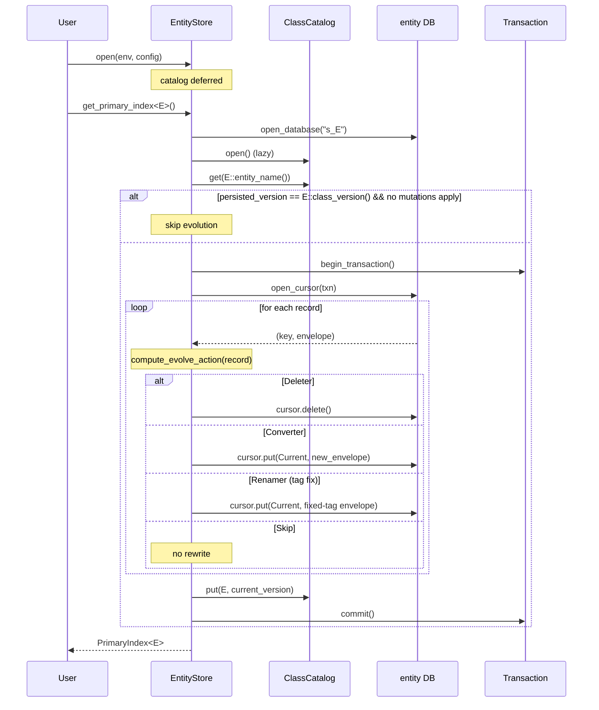

# Wave 2C-2 — DPL Schema Evolution

**Status:** Complete (v1.6).
**Branch:** `fix/wave2c-2-dpl-schema-evolution`.
**Closes audit findings:**

- JE-port-audit-2026-05-overview.md HIGH #4 — *"Schema evolution
  (Mutations / Converter / Renamer / Deleter) has data structures
  but is not wired into the open path.  `EntityStore::evolve(config)`
  returns success without performing the evolution."*
- JE-port-audit-2026-05-overview.md #12 — *"`EntityStore::evolve` is
  non-transactional, hardcodes class version 0, and materialises the
  entire database into RAM via `scan_all_kv`."*
- JE-port-audit-2026-05-overview.md #13 — *"Schema-evolution
  per-record class versions are not stored."*

---

## Summary

Wave 2C-2 lands three fixes that the May 2026 JE-port audit flagged as
HIGH:

1. **Per-record class-version envelope on disk.**  Every entity record
   stored by `PrimaryIndex` is now wrapped in a 3-byte fixed header
   plus the entity class name, allowing the persistence layer to
   detect on-read which schema version a record was written under.
2. **Open-path evolution.**  `EntityStore::open` opens a hidden class
   catalog; the first `get_primary_index<E>()` for each entity class
   compares `E::class_version()` against the persisted catalog and
   runs streamed transactional evolution if they differ.
3. **Streamed, transactional `EntityStore::evolve`.**  The pre-Wave-2C-2
   implementation collected every record into RAM via
   `Database::scan_all_kv` and wrote each back through auto-committed
   `Database::put` calls.  The new path uses a single `Cursor`
   under one `Transaction`, decodes each record's envelope, and
   applies the matching mutation in place via
   `Cursor::put(Put::Current)` / `Cursor::delete()`.

The change is **breaking on disk** for pre-v1.6 entity stores.  See the
[migration guide](../getting-started/migrating.md#on-disk-breaking-changes-wave-2c-2--dpl-entity-record-envelope)
for the dump-and-reload procedure.

---

## On-disk record envelope

Every entity record value carries a 3-byte fixed header followed by the
entity class tag:

```text
+----+----+----+--------+--------+
|     class      | tag |          |
|    version     | len |   tag    |   payload
| (u16, BE)      | u8  | (UTF-8)  |
+----+----+----+--------+--------+
   0    1    2     3      3+len    3+len
```

| Bytes | Field | Notes |
|---|---|---|
| `[0..2]` | `class_version` | u16 BE.  Set from `Entity::class_version()` at write time. |
| `[2..3]` | `entity_class_tag_len` | u8.  Length of the next field in bytes (0 < len ≤ 255). |
| `[3..3+len]` | `entity_class_tag` | UTF-8 bytes of `Entity::entity_name()`. |
| `[3+len..]` | `payload` | Whatever your `EntitySerializer::serialize` emitted. |

The class tag is included so we can:

- **Detect wrong-serializer misuse** — a `PrimaryIndex<u64, Foo>` that
  finds a record tagged `"Bar"` errors loudly instead of producing
  garbage.
- **Apply class-level Renamer mutations** — when the user has
  registered `Renamer::for_class("OldName", v, "NewName")`, the
  read path accepts records tagged `"OldName"`.

This envelope sits **above** the binding-layer `SerdeBinding` 2-byte
version header (Wave 2B): the binding-layer header lives in the
*payload* bytes that this envelope wraps.  The two layers address
different evolution concerns and are independent.

The encoder lives at `noxu_persist::evolve::envelope::encode`; the
decoder at `decode`.  Both are zero-copy on the borrow side.

---

## Class catalog

The `EntityStore` now manages a hidden database
`__noxu_persist_catalog__<store_name>` (one per store).  Each entry
records the most recent class version observed for one entity name:

| Bytes | Field |
|---|---|
| `[0..2]` | catalog format version (currently `1u16` BE) |
| `[2..4]` | current `class_version` for the entity (u16 BE) |
| `[4..6]` | reserved / flags (always `0u16` today) |

The catalog is opened lazily on the first
`EntityStore::get_primary_index` / `EntityStore::evolve` call.  It is
deliberately **not** opened at `EntityStore::open` time because doing
so creates a new database before the existing entity databases have
been opened on the env handle, which can mask their on-disk state in
some recovery sequences.  Lazy open lets the user's first
`open_database` for an entity DB run to completion before the catalog
DB is created.

The catalog is updated atomically with the data writes during the
streamed evolve: the same `Transaction` (or auto-commit if the env
is non-transactional) covers both the cursor `put`/`delete` calls
and the catalog `put`/`remove` call.

`crate::evolve::ClassCatalog` exposes `get`, `put`, `remove`, and
`close`.

---

## Open-path flow



### Evolution action selection

Implemented by `compute_evolve_action` in
`crates/noxu-persist/src/entity_store.rs`:

| Mutation present at on-disk version | Action |
|---|---|
| Class-level `Deleter`        | `Delete` (cursor.delete) |
| Class-level `Converter` returning `Some(new_payload)` | `RewriteWithConverter` (cursor.put with new envelope at target_version + entity_class tag + new_payload) |
| Class-level `Converter` returning `None` | `Delete` |
| Class-level `Renamer` mapping on-disk tag to current entity_name (tag mismatch only) | `RewriteRename` (cursor.put with **on-disk** version preserved, fixed tag, payload unchanged) |
| None                          | `Skip` (lazy field-level evolution handled by `deserialize_versioned`) |

The `Skip` semantics are deliberate: rewriting a record with a fresher
envelope version stamp **without** transforming the payload would
break the `deserialize_versioned(payload, class_version, …)` contract
— the next read would call `deserialize_versioned(_, target_version,
…)` and the user serializer would treat the bytes as the new shape.

### When does evolution run?

The open path runs evolution if **either**:

- the persisted catalog version differs from `E::class_version()`, **or**
- the user has registered any class-level mutation against
  `E::entity_name()` (renamer, deleter, or converter).

The second clause covers the case where catalog and current versions
match but the user wants to apply (e.g.) a class-level `Deleter`.
Mutations that don't actually match any record become `Skip` actions,
so the call remains a no-op and idempotent.

---

## Mutation primitives

| Primitive                                  | Open-path behaviour | Read-path behaviour |
|---|---|---|
| `Renamer::for_class(old, v, new)`          | Eagerly rewrites the on-disk **tag** of records that match `(tag = old, version = v)`; preserves the on-disk version. | Read-side accepts records tagged `old` when the renamer maps `old -> entity_name()`. |
| `Renamer::for_field(class, v, old, new)`   | No-op (advisory). | Passed to user `deserialize_versioned` so user code can do field-level renames lazily. |
| `Deleter::for_class(class, v)`             | Eagerly deletes records that match `(tag, version)`. | N/A (record gone). |
| `Deleter::for_field(class, v, field)`      | No-op (advisory). | Passed to user `deserialize_versioned` so user code can skip the field. |
| `Converter::for_class(class, v, fn)`       | Eagerly runs `fn(payload)` and rewrites with target_version + entity_class tag.  `fn` returning `None` deletes the record. | N/A (record converted). |
| `Converter::for_field(class, v, field, fn)`| No-op (advisory). | Passed to user `deserialize_versioned` so user code can convert the field. |

The asymmetry — class-level eager, field-level lazy — matches JE's
behaviour shape and is the natural fit for our byte-payload model: the
persistence layer cannot decode user payloads without the user's
serializer, but it can wholesale-replace them via a `Converter`.

---

## `EntityStore::evolve(...)` rewritten

The public `evolve(&mut self, &Mutations, &EvolveConfig) ->
Result<EvolveStats>` method is preserved for callers that want to
drive evolution explicitly (matches the JE
`EntityStore.evolve(EvolveConfig)` shape), but it has been rewritten
to use the same streamed transactional path:

- No `Database::scan_all_kv` materialisation.
- All cursor `get` / `put` / `delete` and the catalog update happen
  inside one `Transaction`.
- Honours `EvolveConfig::should_evolve(class)` and
  `EvolveListener::evolve_progress`.  A listener returning `false`
  aborts the transaction (the database is left in its pre-evolve
  state) and returns
  `PersistError::DatabaseError(NoxuError::OperationNotAllowed("...
  evolution of '<class>' aborted by listener"))`.

The function is idempotent: re-running it after a successful evolve
sees no records that match v0 mutations and returns
`EvolveStats { n_read: total, n_converted: 0 }`.

---

## Trait additions

### `Entity::class_version() -> u16`

Default-implemented method; existing entity definitions compile
unchanged.  Bump it whenever you change the on-disk shape of an
entity.  The persistence layer stamps every newly written record's
envelope with this value, and the catalog tracks "the most recently
observed class_version for this entity name".

### `EntitySerializer::deserialize_versioned`

```rust
fn deserialize_versioned(
    &self,
    bytes: &[u8],
    class_version: u16,
    mutations: &Mutations,
) -> Result<E> {
    let _ = class_version;
    let _ = mutations;
    self.deserialize(bytes)
}
```

The default delegates to `deserialize`, so existing serializers are
backward-compatible.  Override it to do **field-level** evolution
on read — switch on `class_version` to call the right decoding logic
for records written by that version.  The `mutations` reference is
the same set the user attached to `StoreConfig::with_mutations`, so
field-level renamers / deleters / converters can be discovered at
runtime.

The persistence layer's `PrimaryIndex::get` / `EntityIterator` always
peel the on-disk envelope and call `deserialize_versioned(payload,
envelope.class_version, mutations)`.

---

## Test coverage

Wave 2C-2 ports the headline JE TCK schema-evolution tests to
`crates/noxu-persist/tests/evolve_test.rs`:

| JE test                          | Noxu test                                    |
|----------------------------------|----------------------------------------------|
| `EvolveTest.testRenamerField` (lazy field renamer) | `evolve_basic_field_rename`            |
| `EvolveTest.testAddField`        | `evolve_add_field_with_versioned_decoder`    |
| `EvolveTest.testRemoveField`     | `evolve_field_deleter`                       |
| `EvolveTest.testClassRenamer`    | `evolve_class_rename`                        |
| `EvolveTest.testClassConverter` + `ConvertAndAddTest` | `convert_and_add_test`           |
| `DevolutionTest.testRevert`      | `devolution_revert_schema`                   |
| `EvolveProxyClassTest`           | `evolve_proxy_class_test`                    |
| (idempotence corner case)        | `evolve_is_idempotent_across_reopens`        |
| (large-store streaming)          | `evolve_streaming_handles_thousand_records`  |
| (transactional rollback)         | `evolve_aborts_on_listener_failure`          |
| (class-level deleter end-to-end) | `evolve_class_deleter_drops_records_and_catalog` |

Each test follows the same shape:

1. **Phase 1:** open env + entity store with the **OLD** entity
   definition (a struct + `Entity` impl with `class_version()` = 0
   or no override), populate, close.
2. **Phase 2:** reopen with the **NEW** entity definition (a
   different Rust struct + `class_version()` = 1) plus a
   `Mutations` set attached via `StoreConfig::with_mutations`.
3. Assert the data is correctly readable / has been transformed.

Plus 11 new in-module unit tests for the supporting types
(`envelope::encode`/`decode`, `ClassCatalog::{get,put,remove}`,
`StoreConfig::with_mutations`/`with_evolve_config`, etc.).

Total: **22 new tests** (11 integration + 11 unit), all passing.  Zero
existing tests broken.

---

## What's deferred to v2.0+

- **`EntityConverter` / `EntityDeleter` / `EntityRenamer` distinct
  from the class-level versions.**  JE has these as separate types;
  our class-level Renamer / Deleter / Converter cover the same
  semantics through the `field_name = None` discriminator on
  `MutationKey`.  A future change can split the API surface if the
  ergonomic gain warrants the source-level breakage.
- **`Mutations::add_renamer` chains across version-unrelated
  renames.**  Today the read path looks up exactly one Renamer per
  record (no chaining).  JE supports
  `Class("A", 0) -> "B"; Class("B", 1) -> "C"` chains; we do not.
  Workaround: write a class-level `Converter` that handles the
  multi-step rename end-to-end.
- **The "evolve all classes that match this prefix" filter shape.**
  `EvolveConfig` filters by exact class name only, mirroring the JE
  shape.

---

## Files touched

- `crates/noxu-persist/src/lib.rs` — re-exports for new types.
- `crates/noxu-persist/src/entity.rs` — `Entity::class_version()`.
- `crates/noxu-persist/src/entity_serializer.rs` — `deserialize_versioned`.
- `crates/noxu-persist/src/store_config.rs` — `with_mutations`,
  `with_evolve_config`.
- `crates/noxu-persist/src/primary_index.rs` — envelope wrap/unwrap on
  `put` / `get` / `EntityIterator`.
- `crates/noxu-persist/src/entity_store.rs` — `ClassCatalog`,
  open-path evolution, streamed `evolve`.
- `crates/noxu-persist/src/evolve/mod.rs` — module additions.
- `crates/noxu-persist/src/evolve/envelope.rs` — **new** record
  envelope module.
- `crates/noxu-persist/src/evolve/catalog.rs` — **new** persistent
  class-version catalog.
- `crates/noxu-persist/tests/evolve_test.rs` — **new** TCK port file.
- `docs/src/collections/entity-persistence.md` — schema-evolution
  section rewrite.
- `docs/src/introduction.md` — capability matrix row.
- `docs/src/getting-started/migrating.md` — Wave 2C-2 breaking-change
  section.
- `docs/src/internal/wave-2c-2-dpl-evolution.md` — this document.
